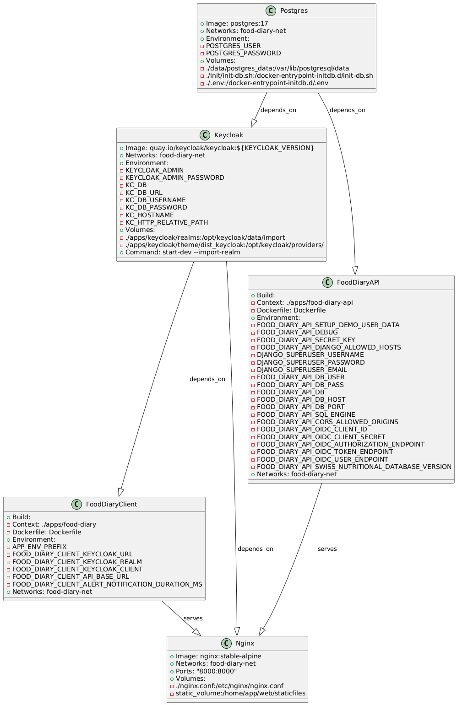

# Food diary main project

## Introduction

The Food Diary application is a web-based tool designed to help users track their daily food intake and monitor the occurrence of symptoms. 
This application not only allows users to log what they eat but also provides valuable insights into the correlation between their food consumption and the symptoms they experience.

The project consists of two main components: a client application and a server (API) application. Additionally, it utilizes an open-source solution (Keycloak) as an external identity provider for user authentication.

## Installation guide
To simplify the installation process, all three components have been consolidated into a single Docker Compose file. This README outlines the steps for setting up the Docker Compose environment. 
Each application can also be installed separately. please refer to the dedicated README files for detailed instructions on local development setups for each application.

There are two methods to install the application: production mode and demonstration mode. Once the application is started in production mode, it cannot be switched to demonstration mode without a complete reinstallation.
To switch between modes, you must clean the Docker Compose installation by running the command `docker-compose down --rmi all`. After that, you need to delete the `/data` folder. Please note that all user data stored in the /data folder will be lost.

Before proceeding, ensure you read and fully understand the instructions. Execute the necessary steps for your preferred installation method. If you're in a hurry and just want a fast demo setup, then you can refer to the TL;DR section below.

### Docker compose deployment
1. install docker on your host
   - ubuntu server installation using snap: `sudo snap install docker`
2. start docker
3. fire up your terminal and go to the root directory of the project
4. copy the dev.env file and save it as .env: `cp dev.env .env`
5. update the .env file:
   - replace the placeholder passwords with secure values
   - replace api secret key with a secure value
   - **good to know:**
     - if you change any hostname or port in the .env file, ensure the changes are also reflected in the main nginx.conf
     - the value of the APP_ENV_PREFIX variable must match the prefix of all client application environment variables within the project .env file. 
     - all top level client application environment variable keys must match to a value of an application level environment variable. These variables will override the environment variables of the client application. For more information, see ./apps/food-diary/env.sh.
6. run the following docker command: `docker-compose up -d`
   - to start the application in demo mode (with demo data seed) run the following command: `docker compose -f docker-compose.yml -f docker-compose-demo-seed.yml up -d`
7. remove unused build images `docker image prune`
8. application is now available at the specified port 8000 -> `localhost:8000`
   - if started in demo mode then the following demo user already exists:
      - **user:** alice 
      - **password:** wonderland 
9. the keycloak admin site is available at `localhost:8000/auth` (credentials defined in the .env file)
10. the django admin site is available at `localhost:8000/admin` (credentials defined in the .env file)
11. update the OIDC client secret for enhanced security (**optional but recommend for production**)
    - open the keycloak admin site in the browser: `localhost:8000/auth`
    - login with your admin credentials
    - select the food-diary realm on the realm drop down
    - select `Clients` form the sidebar navigation
    - select the client: `food-diary-api-client`
    - select the tab `Credentials`
    - regenerate the client secret and copy the new secret
    - stop your deployment: `docker-compose stop`
    - update your docker compose deployment environment variable (.env -> FOOD_DIARY_API_OIDC_CLIENT_SECRET) 
    - restart your deployment: `docker-compose up`
12. Stop all containers
    - stop containers `docker-compose stop` (restart containers: `docker-compose start`)
    - stop and removes containers, networks, volumes created by up: `docker-compose down`
    - stop containers and removes containers, networks, volumes, and images created by up: `docker-compose down --rmi all`
13. remove unused images `docker image prune`
14. remove the folder ./data to remove all the data created by the application

### TL;TR - docker compose deployment for demonstration purpose
1. copy the dev.env file and save it as .env: `cp dev.env .env`
2. `docker compose -f docker-compose.yml -f docker-compose-demo-seed.yml up -d`
3. browser -> `localhost:8000`
4. login
   - **user:** alice
   - **password:** wonderland

### Docker compose deployment UML
